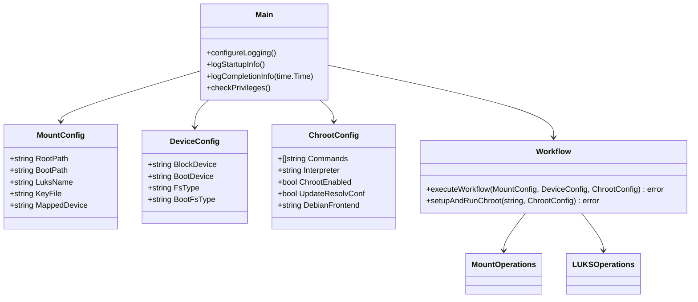
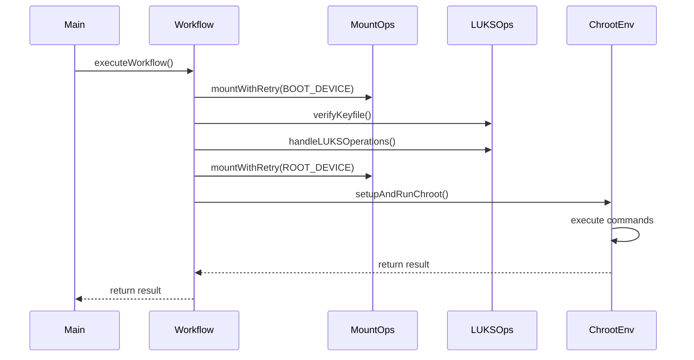

```
quay.io/ssahani/cexec:latest
```
# LUKS Chroot Executor (quay.io/ssahani/cexec:latest)

The LUKS Chroot Executor performs command execution within an encrypted LUKS filesystem environment. It handles LUKS device unlocking, mounting, and provides a secure chroot environment for command execution.

## Architecture Overview



## Execution Flow



## Examples

### Basic LUKS chroot execution
```yaml
actions:
- name: "Execute in LUKS environment"
  image: quay.io/ssahani/cexec:latest
  timeout: 120
  environment:
    BLOCK_DEVICE: /dev/nvme0n1p3
    BOOT_DISK: /dev/nvme0n1p1
    FS_TYPE: ext4
    BOOT_FS_TYPE: vfat
    CHROOT: y
    CMD_LINE: "apt-get update"
```

### Multiple commands with custom interpreter
```yaml
actions:
- name: "System configuration"
  image: quay.io/ssahani/cexec:latest
  timeout: 300
  environment:
    BLOCK_DEVICE: /dev/sda3
    BOOT_DISK: /dev/sda1
    FS_TYPE: ext4
    DEFAULT_INTERPRETER: "/bin/bash -c"
    CMD_LINE: "apt-get update; apt-get upgrade -y"
    UPDATE_RESOLV_CONF: true
    DEBIAN_FRONTEND: noninteractive
```

## Environment Variables

| Env Variable           | Type    | Default   | Required | Description |
|------------------------|---------|-----------|----------|-------------|
| `BLOCK_DEVICE`         | string  | /dev/sda3 | No*      | Encrypted block device |
| `BOOT_DISK`            | string  | /dev/sda2 | No*      | Boot partition |
| `FS_TYPE`             | string  | ext4      | No       | Root filesystem type |
| `BOOT_FS_TYPE`        | string  | ext4      | No       | Boot filesystem type |
| `CHROOT`              | string  | n         | No       | Set to "y" for chroot |
| `CMD_LINE`            | string  |           | Yes      | Command(s) to execute |

## Key Features

1. **LUKS Encryption Support**:
   - Automatic device unlocking with keyfile
   - Keyfile verification (permissions, content)
   - Clean device closure after execution

2. **Robust Mount Management**:
   - Automatic mount point selection
   - Retry logic for mount operations
   - Comprehensive cleanup

3. **Secure Chroot Environment**:
   - Essential filesystems mounted (dev, proc, sys)
   - Optional network configuration
   - Privilege escalation handling

## Exit Codes

| Code | Description |
|------|-------------|
| 0    | Success |
| 1-9  | Configuration errors |
| 10-19| Mount operations failures |
| 20-29| LUKS operations failures |
| 30-39| Chroot execution failures |

## Best Practices

1. Store LUKS keyfile in secure boot partition
2. Set appropriate timeout for chroot operations
3. Review logs for permission warnings
4. Use `DEBIAN_FRONTEND=noninteractive` for package operations
5. Verify device paths before execution

The `quay.io/ssahani/cexec:latest` image provides this enhanced LUKS-capable chroot execution environment while maintaining compatibility with standard cexec workflows.
