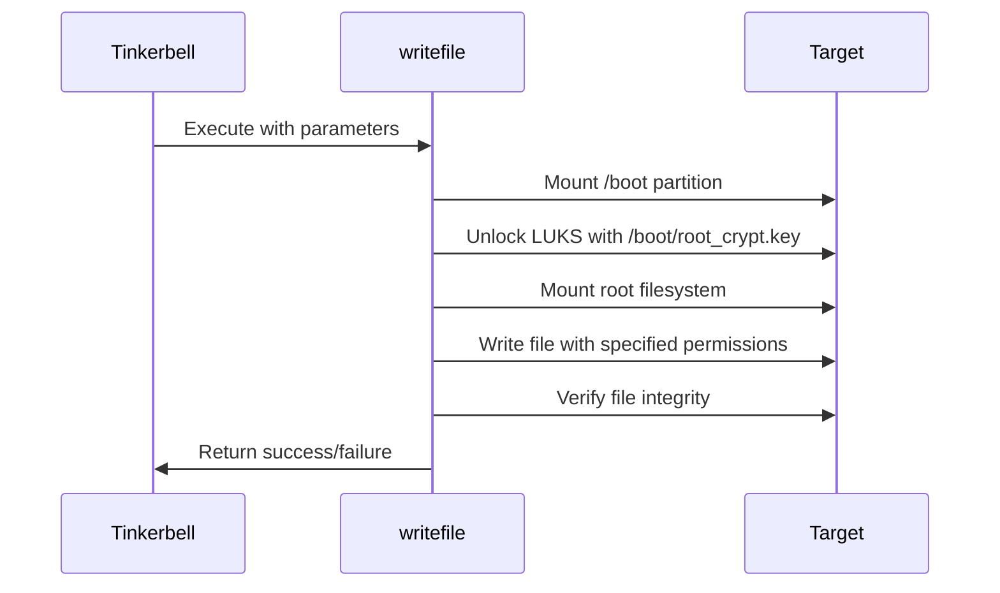

# Secure Disk Encryption for Kubernetes Ubuntu Images

[](LICENSE)
[](https://quay.io/repository/ssahani/writefile)

## Overview

A complete solution for provisioning LUKS-encrypted Ubuntu systems in Kubernetes environments, featuring:

1. Ubuntu image encryption tooling
2. Tinkerbell-compatible writefile action for encrypted filesystems

## Problem Statement

The default Ubuntu raw images from [Kubernetes SIGs Image Builder](https://github.com/kubernetes-sigs/image-builder) lack disk encryption, creating security gaps. Additionally:

- Standard provisioning tools can't write to LUKS-encrypted devices
- No integrated solution exists for encrypted provisioning workflows

## Solution Components

### 1. Ubuntu Disk Encryptor
**Repository**: [ssahani/ubuntu-disk-encryptor](https://github.com/ssahani/ubuntu-disk-encryptor)

Prepares encrypted base images:
```bash
./encrypt-ubuntu-image.sh -i input.img -o encrypted.img -k /path/to/keyfile
```

### 2. writefile Tinkerbell Action
**Container**: `quay.io/ssahani/writefile:latest`

Writes files to LUKS-encrypted root filesystems during provisioning:

```yaml
- name: write-netplan
  image: quay.io/ssahani/writefile:latest
  pid: host
  privileged: true
  timeout: 90
  environment:
    DEST_DISK: /dev/sda3
    BOOT_DISK: /dev/sda2
    DEST_PATH: /etc/netplan/config.yaml
    CONTENTS: |
      network:
        version: 2
        ethernets:
          enp1s0:
            dhcp4: false
            addresses: [192.168.1.100/24]
```

## How It Works

### writefile Action Architecture



## Getting Started

### Prerequisites
- Kubernetes cluster with Tinkerbell
- Encrypted Ubuntu image (see Ubuntu Disk Encryptor)
- `cryptsetup` on target machines

### Basic Usage

1. Build encrypted base image:
```bash
git clone https://github.com/ssahani/ubuntu-disk-encryptor
./encrypt-ubuntu-image.sh -i ubuntu-22.04.img -o ubuntu-22.04-encrypted.img
```

2. Add writefile action to your workflow:
```yaml
actions:
  - name: configure-network
    image: quay.io/ssahani/writefile:latest
    pid: host
    privileged: true
    environment:
      DEST_DISK: /dev/sda3
      BOOT_DISK: /dev/sda2
      DEST_PATH: /etc/netplan/00-installer-config.yaml
      CONTENTS: |
        network:
          version: 2
          ethernets:
            eth0:
              dhcp4: true
      FILE_MODE: "0644"
```

### Configuration Options

| Variable       | Required | Description                          | Example        |
|----------------|----------|--------------------------------------|----------------|
| `DEST_DISK`    | Yes      | LUKS-encrypted root partition        | `/dev/sda3`    |
| `BOOT_DISK`    | Yes      | Unencrypted boot partition           | `/dev/sda2`    |
| `DEST_PATH`    | Yes      | Full destination file path           | `/etc/hosts`   |
| `CONTENTS`     | Yes      | File contents (multiline supported)  | `"hello"`      |
| `BOOT_FS_TYPE` | No       | Boot partition filesystem (default: ext4) | `vfat`     |
| `ROOT_FS_TYPE` | No       | Root filesystem type (default: ext4) | `xfs`          |
| `FILE_MODE`    | No       | File permissions (default: 0644)     | `"0600"`       |
| `DIR_MODE`     | No       | Parent dir permissions (default: 0755) | `"0700"`     |
| `UID`         | No       | File owner UID (default: 0)          | `"1000"`       |
| `GID`         | No       | File group GID (default: 0)          | `"1000"`       |

## Security Features

- **LUKS2 Encryption**: Modern encryption with Argon2 PBKDF
- **Secure Key Handling**: Keyfile stored on separate boot partition
- **Atomic Writes**: Ensures filesystem consistency
- **Permission Enforcement**: Strict mode/ownership control

## Troubleshooting

**Error: Failed to open LUKS device**
- Verify `DEST_DISK` points to correct partition
- Ensure keyfile exists at `/boot/root_crypt.key`

**Error: Mount failed**
- Check `BOOT_FS_TYPE` and `ROOT_FS_TYPE` match actual filesystems
- Verify partitions aren't already mounted

## Contributing

1. Fork the repository
2. Create your feature branch
3. Submit a pull request

## License

Apache 2.0 - See [LICENSE](LICENSE) for details.
